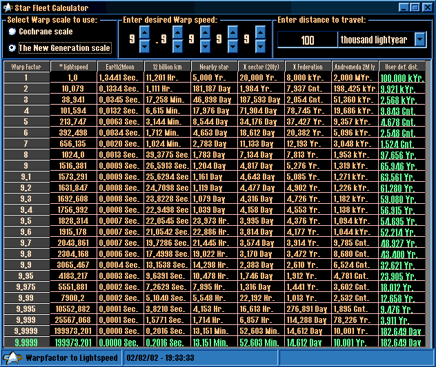



## Star Fleet Warp Calculator

### Description

This program displays a table with lightspeed values as calculated from Warp 1 to Warp 9.9999 (or if using the old Cochrane scale from 1 to 24), it also lists time to travel to the moon, nearest star, etc. with these speeds. You can enter your own distance or warpspeed as well.
 
### More Info
 
Warpspeed is a term that stems from Paramount's Star Trek series and movies. http://www.ditl.org for the Daystrom Institute of Technology Library, which explains a lot of Star Trek technology...

             |
---                |---
**Submitted On**   |2002-02-02 19:48:36
**By**             |[N/A](https://github.com/Planet-Source-Code/PSCIndex/blob/master/ByAuthor/empty.md)
**Level**          |Intermediate
**User Rating**    |4.7 (28 globes from 6 users)
**Compatibility**  |VB 6\.0
**Category**       |[Complete Applications](https://github.com/Planet-Source-Code/PSCIndex/blob/master/ByCategory/complete-applications__1-27.md)
**World**          |[Visual Basic](https://github.com/Planet-Source-Code/PSCIndex/blob/master/ByWorld/visual-basic.md)
**Archive File**   |[Star\_Fleet52518222002\.zip](https://github.com/Planet-Source-Code/star-fleet-warp-calculator__1-31439/archive/master.zip)

